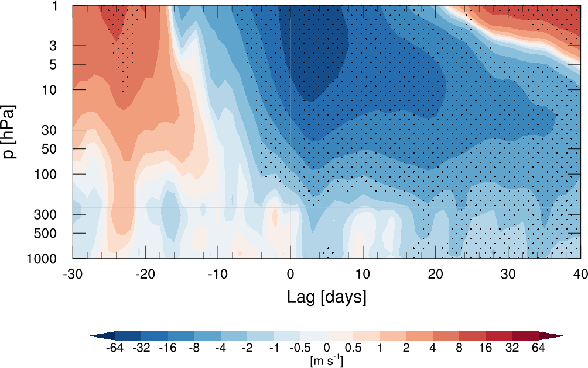
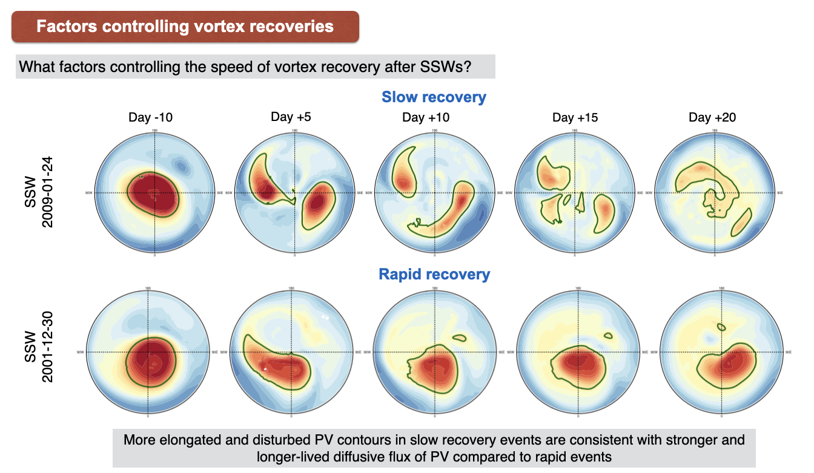

# Sudden Stratospheric Warmings

**Sandro W. Lubis, Ph.D.**
Pacific Northwest National Laboratory (PNNL)

This repository provides simple **NCL scripts for identifying major sudden stratospheric warming (SSW) and stratospheric final warming (SFW) events**, together with an example lag-composite analysis of the stratospheric circulation.

The SSW definition follows **Charlton and Polvani (2007)**.

## Citation

If you use these scripts, please also consider citing:

**Lubis, S. W., C. S. Y. Huang, and N. Nakamura (2018b):**
*Role of Finite-Amplitude Eddies and Mixing in the Life Cycle of Stratospheric Sudden Warmings.*
Journal of the Atmospheric Sciences, **75**, 3987–4003.
https://doi.org/10.1175/JAS-D-18-0138.1

**Lubis, S. W., C. S. Y. Huang, N. Nakamura, N.-E. Omrani, and M. Jucker (2018a):**
*Role of Finite-Amplitude Rossby Waves and Nonconservative Processes in Downward Migration of Extratropical Flow Anomalies.*
Journal of the Atmospheric Sciences, **75**, 1385–1401.
https://doi.org/10.1175/JAS-D-17-0376.1

---

---

## Major Sudden Stratospheric Warmings

A major SSW is identified using the daily-mean zonal-mean zonal wind at **10 hPa and 60°N**.

### Criteria

1. The SSW central date is the first day when the zonal-mean zonal wind reverses from westerly to easterly between **November and March**.

2. The wind must return to westerly conditions for at least **20 consecutive days** between events to avoid counting the same warming multiple times.

3. If the wind does not return to westerly conditions for at least **10 consecutive days before 30 April**, the event is considered a final warming and is excluded from the major SSW list.

### Script

```text
ssw_events_selection.ncl
```

---

## Stratospheric Final Warmings

The SFW marks the seasonal breakdown of the wintertime stratospheric polar vortex.

The script identifies the final transition to easterly winds using the zonal-mean zonal wind at **10 hPa and 70°N**.

### Criteria

1. A **5-day running mean** of the zonal-mean zonal wind is used.

2. The SFW date is identified from the final transition from westerly to easterly flow.

3. The circulation must not subsequently recover above the specified positive threshold of **10 m s⁻¹** before the following seasonal transition.

### Script

```text
sfw_events_selection.ncl
```

---

## SSW Lag Composite

The repository also includes an example script for calculating lag composites of zonal-mean zonal-wind anomalies around SSW central dates:

```text
lag_composite_ssw_uz_50N-70N_stipple.ncl
```

The composite spans approximately **40 days before to 40 days after** the SSW central date (Lubis et al., 2018a).

<p align="center">
  
</p>

An additional example of the SSW evolution is shown below (Lubis et al., 2018b).

<p align="center">
  
</p>

---

## Running the Scripts

Identify SSW events:

```bash
ncl ssw_events_selection.ncl
```

Identify SFW events:

```bash
ncl sfw_events_selection.ncl
```

Generate the SSW lag composite:

```bash
ncl lag_composite_ssw_uz_50N-70N_stipple.ncl
```

Input paths, variable names, pressure levels, and analysis periods can be modified directly in the scripts.

---

## References

For the SSW definition:

**Charlton, A. J., and L. M. Polvani (2007):**
*A New Look at Stratospheric Sudden Warmings. Part I: Climatology and Modeling Benchmarks.*
Journal of Climate, **20**, 449–469.

For the SFW framework:

**Black, R. X., and B. A. McDaniel (2007):**
*The Dynamics of Northern Hemisphere Stratospheric Final Warming Events.*
Journal of the Atmospheric Sciences, **64**, 2932–2946.

---
